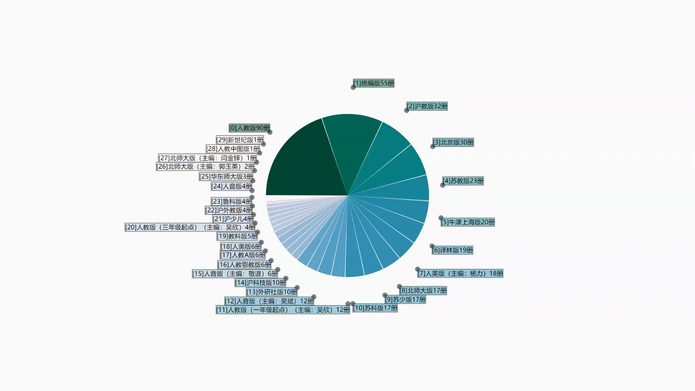

# stirpie [](https://www.npmjs.com/package/stirpie)

[](https://stackblitz.com/edit/js-gnrnge?file=index.js "Click to Edit")

It's dispensable to have resolving overlapping labels for a pie chart on most occasions, but whenever people want it and without one, it's critical. `stirpie` is a simple library to resolve overlapping labels outside of a pie chart, which has already been sorted in descending order. Click above picture to edit the [example](example/index.html) lively.

## Usage

### Importing stirpie

```html
<!-- as a UMD bundle  -->
<script src="stirpie.min.js"></script>
```

```js
// as a TS/ES module
import stirpie from "stirpie";

// as a CommonJS module
const stirpie = require("stirpie");
```

### Resolving labels

Preparing sample data:

```js
// sample1 has already been sorted in descending order
const sample1 = await d3.json("example/sample1.json");
```

Creating pie data:

```js
const radius = 128;
const pie = d3
  .pie()
  .startAngle(-0.5 * Math.PI)
  .endAngle(1.5 * Math.PI)
  .padAngle(1 / radius)(sample1.values);
```

Initialize labels' width/height:

```js
const dimensions = sample1.labels.map((d) => {
  let width, height;
  // e.g. getBBox() from SVGElement, or calculating as you like
  // ...
  return {
    width,
    height,
  };
});
```

Resolving labels as many as possible:

```js
// or assigns [radius + 25, radius + 50] to use an ellipse
const orbitRadius = radius + 25;
const resolver = stirpie(dimensions, pie, orbitRadius).resolve(true);
```

Rendering resolved labels or do whatever you want for collided ones:

```js
for (const box of resolver.boxes) {
  const { i, minX, maxX, minY, maxY } = box;
  if (i >= resolver.resolved) {
    // this one is still collided
    // ...
  } else {
    // this one has resolved successful
    // ...
  }
}
```

### Definitions

See [index.ts](index.ts).

### Dependencies

- [RBush](https://github.com/mourner/rbush/)
